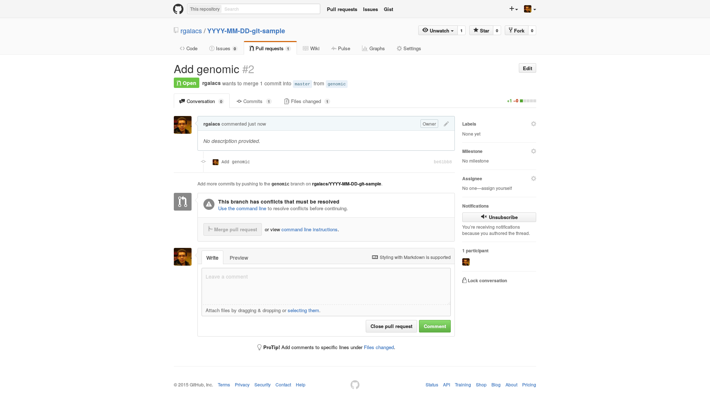

> ## Learning Objectives {.objectives}
>
> * Understand rebase.

Sometimes we need to intervine when merging two branches because they have conflicts.

> ## What is a conflict? {.callout}
>
> [Software Carpentry's Version Control with Git](https://swcarpentry.github.io/git-novice/09-conflict.html)
> has a great explanation about conflicts.

When there are conflicts on our pull request,
GitHub doesn't allow us to merge that pull request
**until** we resolve the conflict.

So far GitHub doesn't have a web interface that we can use to resolve conflicts
so we need to resolve the conflict locally.

Before we start resolving the conflict we should update our local copy of the
Git repository.

~~~ {.bash}
$ git fetch --all
~~~
~~~ {.out}
Fetching origin
remote: Counting objects: 1, done.
remote: Total 1 (delta 0), reused 0 (delta 0), pack-reused 0
Unpacking objects: 100% (1/1), done.
From github.com:rgaiacs/YYYY-MM-DD-git-sample
   3f3c1bf..2e52159  master     -> origin/master
~~~
~~~ {.bash}
$ git lga
~~~
~~~ {.out}
*   2e52159 (origin/master) Merge pull request #1 from rgaiacs/abduction
|\  
| * fb8dde2 (origin/abduction, abduction) Add abduction
|/  
| * 79ee287 (HEAD -> voluntary, origin/voluntary) Add voluntary
|/  
| * be61bb8 (origin/genomic, genomic) Add genomic
|/  
| * 8413095 (origin/camp, camp) Add camp
|/  
* 3f3c1bf (master) Add words
* 22dcdb5 Add words
*   92808ea Add words
|\  
| * 5121eef Add words
* |   ee40506 Add words
|\ \  
| |/  
|/|   
| * 51bd45c Add words
| * ee87332 Add words
* | 87db327 Add words
|/  
* cde9009 Add Python \o/
* 23c6a6b Add words
* 6318870 Begin
~~~

Our branch `master` isn't at the same commit of our commit `origin/master`.
We can fix that with

~~~ {.bash}
$ git checkout master
~~~
~~~ {.out}
Switched to branch 'master'
~~~
~~~ {.bash}
$ git merge origin/master
~~~
~~~ {.out}
Updating 3f3c1bf..2e52159
Fast-forward
 en.dic | 1 +
 1 file changed, 1 insertion(+)
~~~

One way to resolve the conflict is merging the `genomic` branch into `master`
and push `master` to GitHub.
This is the procedure used
on [Software Carpentry's Version Control with Git](https://swcarpentry.github.io/git-novice/09-conflict.html).

> ## Resolve conflicts with merge {.callout}
>
> If we need to resolve that conflict using merge
> we can
>
> ~~~ {.bash}
> $ git merge genomic
> ~~~
> ~~~ {.out}
> Auto-merging en.dic
> CONFLICT (content): Merge conflict in en.dic
> Automatic merge failed; fix conflicts and then commit the result.
> ~~~
>
> Edit `en.dic` with our favorite text editor.
> And
>
> ~~~ {.bash}
> $ git commit -am 'Merge genomic and master'
> ~~~
> ~~~ {.out}
> [master 63d4f56] Merge genomic and master
> ~~~
>
> We end with a Git tree like
>
> ~~~ {.bash}
> $ git lga
> ~~~
> ~~~ {.out}
> *   63d4f56 (HEAD -> master) Merge genomic and master
> |\  
> | * be61bb8 (origin/genomic, genomic) Add genomic
> * |   2e52159 (origin/master) Merge pull request #1 from rgaiacs/abduction
> |\ \  
> | |/  
> |/|   
> | * fb8dde2 (origin/abduction, abduction) Add abduction
> |/  
> * 3f3c1bf Add words
> * 22dcdb5 Add words
> *   92808ea Add words
> |\  
> | * 5121eef Add words
> * |   ee40506 Add words
> |\ \  
> | |/  
> |/|   
> | * 51bd45c Add words
> | * ee87332 Add words
> * | 87db327 Add words
> |/  
> * cde9009 Add Python \o/
> * 23c6a6b Add words
> * 6318870 Begin
> ~~~

Another way that we can resolve the conflict is using [graft](https://en.wikipedia.org/wiki/Grafting).

The advantages of use graft is that
it allows you to keep using the same pull request on GitHub for discussion
and the Git tree will be easier to understand by humans.

We start moving to the branch that we will use as scion,
in other words, the branch that we want to cut and insert in another point.

~~~ {.bash}
$ git checkout genomic
~~~
~~~ {.out}
Switched to branch 'genomic'
~~~

To do the graft we run

~~~ {.bash}
$ git rebase master
~~~
~~~ {.out}
First, rewinding head to replay your work on top of it...
Applying: Add genomic
Using index info to reconstruct a base tree...
M       en.dic
Falling back to patching base and 3-way merge...
Auto-merging en.dic
CONFLICT (content): Merge conflict in en.dic
error: Failed to merge in the changes.
Patch failed at 0001 Add genomic
The copy of the patch that failed is found in: .git/rebase-apply/patch

When you have resolved this problem, run "git rebase --continue".
If you prefer to skip this patch, run "git rebase --skip" instead.
To check out the original branch and stop rebasing, run "git rebase --abort".
~~~

To solve the conflict we edit `en.dic` with our favorite text editor.
After that we run

~~~ {.bash}
$ git add en.dic
~~~
~~~ {.bash}
$ git rebase continue
~~~
~~~ {.out}
Applying: Add genomic
~~~

We can check the Git history:

~~~ {.bash}
$ git lga
~~~
~~~ {.out}
* 905a65e (HEAD -> genomic) Add genomic
*   2e52159 (origin/master, master) Merge pull request #1 from rgaiacs/abduction
|\  
| * fb8dde2 (origin/abduction, abduction) Add abduction
|/  
| * 79ee287 (origin/voluntary, voluntary) Add voluntary
|/  
| * be61bb8 (origin/genomic) Add genomic
|/  
| * 8413095 (origin/camp, camp) Add camp
|/  
* 3f3c1bf Add words
* 22dcdb5 Add words
*   92808ea Add words
|\  
| * 5121eef Add words
* |   ee40506 Add words
|\ \  
| |/  
|/|   
| * 51bd45c Add words
| * ee87332 Add words
* | 87db327 Add words
|/  
* cde9009 Add Python \o/
* 23c6a6b Add words
* 6318870 Begin
~~~

If the `genomic` branch is in the correct place we can push it to GitHub.
**We will need to force the push!**

~~~ {.bash}
$ git push -f origin genomic
~~~
~~~ {.out}
Counting objects: 3, done.
Delta compression using up to 4 threads.
Compressing objects: 100% (2/2), done.
Writing objects: 100% (3/3), 295 bytes | 0 bytes/s, done.
Total 3 (delta 1), reused 0 (delta 0)
To git@github.com:rgaiacs/YYYY-MM-DD-git-sample.git
 + be61bb8...905a65e genomic -> genomic (forced update)
~~~

When we check our pull request on GitHub
we will see that now we can merge it.

Let merge that pull request.

And get the merge into our local copy.

~~~ {.bash}
$ git checkout master
~~~
~~~ {.out}
Switched to branch 'master'
~~~
~~~ {.bash}
$ git pull origin master
~~~
~~~ {.out}
remote: Counting objects: 1, done.
remote: Total 1 (delta 0), reused 0 (delta 0), pack-reused 0
Unpacking objects: 100% (1/1), done.
From github.com:rgaiacs/YYYY-MM-DD-git-sample
 * branch            master     -> FETCH_HEAD
   2e52159..d4d04ce  master     -> origin/master
Updating 2e52159..d4d04ce
Fast-forward
~~~
~~~ {.bash}
$ git lga
~~~
~~~ {.out}
*   d4d04ce (HEAD -> master, origin/master) Merge pull request #2 from rgaiacs/genomic
|\  
| * 905a65e (origin/genomic, genomic) Add genomic
|/  
*   2e52159 Merge pull request #1 from rgaiacs/abduction
|\  
| * fb8dde2 (origin/abduction, abduction) Add abduction
|/  
| * 79ee287 (origin/voluntary, voluntary) Add voluntary
|/  
| * 8413095 (origin/camp, camp) Add camp
|/  
* 3f3c1bf Add words
* 22dcdb5 Add words
*   92808ea Add words
|\  
| * 5121eef Add words
* |   ee40506 Add words
|\ \  
| |/  
|/|   
| * 51bd45c Add words
| * ee87332 Add words
* | 87db327 Add words
|/  
* cde9009 Add Python \o/
* 23c6a6b Add words
* 6318870 Begin
~~~

> ## Gotta Merge 'Em All {.challenge}
>
> <!-- This is a reference to "Gotta catch 'em all", the slogan of the [Pokémon](https://en.wikipedia.org/wiki/Pok%C3%A9mon). -->
>
> Rebase the branches `camp` and `voluntary` into `master`,
> push them to GitHub,
> merge the pull request
> and get the merged commit.
>
> **Tip:** If you do the steps in parallel because you will get a conflict.
